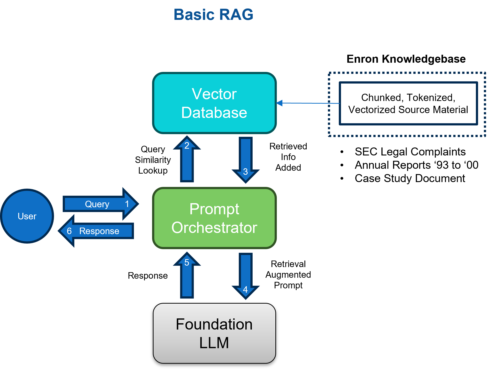
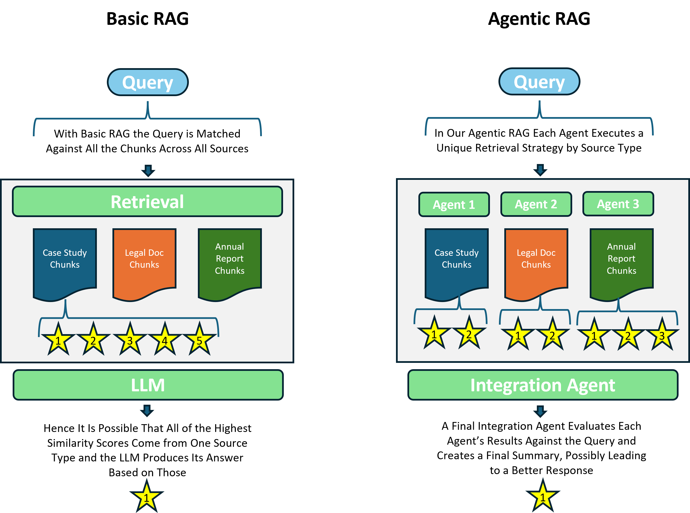

# Introduction 

Agentic retrieval-augmented generation (RAG) with large language models (LLMs) is a cutting-edge research area, combining the power of large language models with the ability to interact with external data and perform actions in real-world contexts. This enables the creation of agents capable of reasoning, planning, and executing tasks to solve complex problems. For instance, agentic RAG systems can perform:

- **Math Problem Solving**: Using agents to autonomously or collaboratively solve math problems, with agents specializing in areas like equation solving, symbolic manipulation, or accessing external mathematical resources.
  
- **Retrieval-Augmented Code Generation**: Employing agents to generate code, with one agent focused on retrieving relevant code snippets from a database, and another responsible for assembling and refining the code based on the retrieved information.
  
- **Decision Making in Text-Based Environments**: Building agents that can navigate and interact within simulated environments using natural language commands, with specialized agents handling tasks like planning, object manipulation, or reasoning about the environment.

The combination of reasoning and acting makes agentic RAG a promising approach for developing more capable and trustworthy AI systems with enhanced understanding and interaction capabilities[1](#ref-1).

## Project Overview

Our Capstone project builds on our Milestones 1 and 2[2](#ref-2), where we extracted data sources and developed a basic RAG solution for a **customer support use case**. In this Capstone project:

- **Public legal, financial, and historical documents related to the Enron case** serve as a proxy for the knowledgebase.
- **The Enron email corpus** represents a range of employee and/or customer emails.

Ideally, we would have liked to have used a product or service company's corporate technical manuals, implementation guides, support FAQs, and related customer support emails as our data sources. Given the difficulty in obtaining such materials, the Enron data has proven a valuable proxy due to its broad content coverage across various document types and email exchanges.

Our goal was to investigate whether agentic RAG improved results over basic RAG using specialized agents and workflows, such as:

- **Chaining Agents**: Chaining agents can be used to break up the task into a series of smaller steps. Each agent in the chain would be responsible for a specific part of the overall task, like retrieval, summarization, or question answering. An agent that specializes in legal documents could, for example, retrieve the appropriate sections of a document based on what the user asks. The information retrieved by the first agent could then be passed to a summarization agent to be condensed into smaller, more concise insights.

- **Specializing Agent Interaction with Data**: Each agent can be specialized for a specific data source so that the agent becomes an expert in understanding and retrieving information from that source. Having specialized agents could really improve the relevance and accuracy of the information that they retrieve. For instance, an agent that was specifically trained on financial reports would be better at answering questions about how Enron was performing financially.

- **LLM as an Intermediate Summary Processor**: LLMs can be used as a central processing unit to take the summaries from different specialized agents and synthesize them into a single response. This approach would help the chatbot to present a clear and consistent picture of the Enron case, even though the case is very complex.

### Inspiration: Unstructured.io's RAG Solution

One example of an effective support use case RAG system is Unstructured.io's chatbot, which operates on their documentation page and Slack channel. This tool provides detailed and accurate answers, representing the type of capability we aimed to emulate in our Enron project.

Visit their documentation here:  
[Unstructured.io Documentation](https://docs.unstructured.io/welcome)

Their site linked above includes a chatbot in the lower right corner, which we speculate may also support their internal employees and automated email responses. We experimented with document extraction using Unstructured's products in Milestone 2, and our interactions with this chatbot demonstrated its high capacity for providing relevant information, embodying the functionality we sought to implement with the Enron dataset.

### Capstone Project Implementation and Hypothesis

In Milestone 2, we performed initial testing with a basic RAG setup (see Figure 1). Our Capstone project expands upon this with the goal of testing whether agentic RAG improves results with the Enron knowledgebase when compared with basic RAG or unaugmented LLM responses, all using the GPT-3.5 Turbo model. Additionally, we created an agent to search via API through the extensive Enron email corpus, located on a cloud database service, and retrieve emails related to the user's query.

**Figure 1**  
*Basic RAG Architecture:*  

Our primary hypothesis is that utilizing one agent per data source type will enhance the chatbot's overall response quality, particularly for compound questions. Each agent is equipped with customized retrieval parameters, in an attempt to optimize for its respective data source. See Figure 2 for a visual of the anticipated benefits.

**Figure 2**  
*Advantages of Specialized Agentic RAG Configuration:*  

# Methods

## Project Methodology

**Methodology** explains how we attempted to solve the problem and justifies our methodological approach, while **Evaluation Strategy** defines what a successful outcome would be.

### Phase 0: Experimentation and Feasibility Prototyping
- **High-Level Design:** Researched agentic patterns[3](#ref-3).
- **High-Level Design:** Experimented with agnetic libraries and did prototype feasibility coding.

### Phase 1: Minimum Viable Product (MVP)
- **Detailed Design:** Defined our agentic pattern flow and email retrieval (see Figure 3). Decided upon coding agents with python classes rather than using an agentic library.
- **Detailed Design:** Defined evaluation criteria after agent design was defined.

### Phase 2: Enhancements
- **Implemented Enhancements:** Integrated the Email Agent.
- **Updated Evaluation Criteria:** Email Agent evlaution.

## Agent Design Rationale
Each agent's retrieval pipeline and summarization strategy leverages specific parameters and prompts tailored to the nature of the documents it handles, aiding in the goal of summaries that are both precise and contextually relevant.

**Figure 3**
*Agent Design and Workflow:*

### Perception Agent 1 - Case Study Data

**Retrieval Pipeline**:
- **Threshold of 0**: Includes all documents with cosine similarity greater than zero to ensure comprehensive coverage.
- **Top 2 Documents**: Focuses on the most relevant documents to maintain precision.
- **Context Window of 1**: Adds plus one and minus one adjacent documents for richer context and understanding.

**Summarization Strategy**:
- **Concise Summarization**: Summarizes in two sentences focusing on the most crucial details, providing quick insights into complex case documents.

**Objective**:
- Designed to efficiently distill a chronologically consistent case summary of Enron, providing users with quick, actionable insights while ensuring no detail is overlooked.

### Perception Agent 2 - SEC Legal Complaint Documents

**Retrieval Pipeline**:
- **Threshold of 0.3**: Filters for moderate to high relevance, reducing noise.
- **Top 2 Documents**: Ensures focus on the most pertinent content.
- **Context Window of 1**: Includes immediate neighbors to capture essential legal contexts.

**Summarization Strategy**:
- **Legal Focus**: Summarizes critical legal elements like relevant people and dates in two sentences, streamlining legal review processes.

**Objective**:
- Configured for well-organized legal data where precise and accurate document retrieval is seen as helpful for precision, compliance and regulatory affairs.

### Perception Agent 3 - Annual Financial Reports

**Retrieval Pipeline**:
- **Threshold of 0**: Captures all potentially relevant financial reports.
- **Top 1 Document**: Concentrates on the single most pertinent document for detailed analysis.
- **Context Window of 2**: Expands context significantly with the two before and after to capture related financial data broad context.

**Summarization Strategy**:
- **Financial Analysis**: Integrates financial insights into a concise two-sentence summary focusing on key financial facts and trends.

**Objective**:
- Succinct summaries that highlight key information and financial figures from the relvant document chunks.

### Integration Agent - Final Summary Integration

**Summarization Strategy**:
- **Comprehensive Integration**: Combines summaries from all agents, using a prompt that directs the LLM to answer the query with a response reflecting relevant underlying data.

**Objective**:
- To provide a comprehensive and nuanced overview of the diverse data, attempting to provide users with a response that aids in complex decision-making processes across various document types.

## Evaluation Strategy

# Results

# Discussion

# Appendix

## References

1. [La Cava, L., & Tagarelli, A. (2024). Safeguarding Decentralized Social Media: LLM Agents for Automating Community Rule Compliance. arXiv.](#ref-1) https://arxiv.org/abs/2409.08963
2. [Bodas, A., Goldhardt, N., & Schaumburg, G. (n.d.). _Milestone 2_. GitHub.](#ref-2) https://github.com/bodasa-umich/Milestone2
3. [Doe, J. (2023, September 22). Designing Cognitive Architectures: Agentic Workflow Patterns from Scratch. _Medium_.](#ref-3) https://medium.com/google-cloud/designing-cognitive-architectures-agentic-workflow-patterns-from-scratch-63baa74c54bc

## Statement of Work

Statement on Use of Generative AI: Tools such as ChatGPT, Gemini, and Copilot were used in our project for experimentation on tasks such as evaluation query creation, code consultation, as well as searching on approaches and concepts.

[Anandita and Gary work items to be added here.]

## Other

[Include any additional information or sections here.]

### Notes (remove the below for final - keeping just as reference materials for now)

The project may explore emerging tools for agentic RAG that could be used for:

- **Workflow Management Systems**: Systems like StateFlow can be used to define the steps that agents need to follow to complete their task. This could be helpful for the Enron chatbot, because the information about the case comes from so many different sources. For example, the workflow could define a state for "retrieving legal documents" and a state for "summarizing financial reports."

- **Dynamic Group Chat**: Systems like AutoGen can be used to simulate a conversation between different agents. This type of system could be more flexible and engaging for users. For example, the Enron chatbot could have a "legal expert" agent and a "financial analyst" agent that users could interact with directly.

- **Prompt Engineering**: Different prompting strategies can be used to influence how LLMs reason about information. "Chain-of-thought" prompting and "self-consistency" prompting are two promising strategies. These strategies may be evaluated to see how well they work for the Enron chatbot.

- **Decoding Methods**: By default, LLMs use a "greedy decoding" approach to generate responses. However, LLMs can also generate responses using different approaches. We may experiment with alternative decoding methods, such as "top-k sampling," to see if these methods lead to better results for the Enron chatbot.

#### Agentic LLM Project Design Guidelines Which May Serve As Our Goals

Projects that benefit from agentic LLM structures often involve tasks that can be broken down into distinct sub-tasks, each potentially requiring different capabilities or data sources. This structure becomes particularly useful when these sub-tasks need to be executed in a specific order or require a dynamic interaction based on the outcome of previous steps. Here are some guidelines for designing such projects:

#### Identify the Core Sub-Tasks:

- **Different Data Types**: If your project requires retrieving and processing information from different data types like text, code, or structured data, consider using different agents specialized for each type. For instance, one agent could be responsible for parsing code, while another handles database queries.
  
- **Different Knowledge Domains**: When dealing with tasks that span multiple knowledge domains, using separate agents with expertise in each domain can be beneficial. For example, in a medical diagnosis project, one agent could focus on analyzing symptoms, while another specializes in interpreting medical literature.
  
- **Different Tasks within a Workflow**: Break down the overall project workflow into distinct tasks, each handled by a specific agent. This approach proves valuable when tasks require different capabilities. For instance, one agent could be responsible for generating code, another for checking its safety, and a third for executing it.

#### Design the Interaction Flow:

- **Static vs. Dynamic Conversations**: Determine whether the interaction between agents should follow a predefined, static order, or if it requires flexibility and adaptation based on intermediate results. Static patterns are simpler to implement, but dynamic patterns offer greater flexibility in complex scenarios.
  
- **Centralized vs. Decentralized Control**: Decide whether a central agent will coordinate the workflow, dispatching tasks to specialized agents and processing their results, or if agents will communicate directly in a more decentralized manner. Centralized control can simplify coordination, while decentralized control might be more robust and scalable.
  
- **Human Involvement**: Determine the role of humans in the loop. This could range from providing initial instructions, to validating intermediate outputs, to taking over control in case of errors. Striking the right balance between human oversight and agent autonomy is crucial for trust and reliability.

#### Agent Capabilities and Design:

- **LLM Configuration**: Carefully choose the appropriate LLM for each agent, considering factors like model size, capabilities, and cost-effectiveness. For instance, a smaller LLM might suffice for straightforward tasks, while a larger, more capable model could be necessary for complex reasoning or code generation.
  
- **Tool Integration**: Incorporate external tools to augment agent capabilities. This could involve accessing databases, executing code, or leveraging APIs for specific functionalities.
  
- **Memory Management**: Design mechanisms for agents to access and manage shared or individual memories, allowing them to retain relevant information from previous interactions or access external knowledge bases.

#### Evaluation and Refinement:

- **Define Clear Metrics**: Establish clear metrics to evaluate the performance of your agentic system, aligning them with the specific goals of your project. These metrics could include task completion rate, accuracy, cost, latency, or human effort saved.
  
- **Iterative Refinement**: Continuously monitor, analyze, and refine your agentic system based on its performance and identify areas for improvement, such as agent capabilities, interaction patterns, or tool integration.

#### Key Considerations:

- **Robustness and Error Handling**: Agentic LLM systems can be complex and prone to errors. Implement mechanisms to handle unexpected situations, such as agent failures, ambiguous instructions, or conflicting information.
  
- **Ethical Implications**: Consider the ethical implications of your project, particularly when agents interact with real-world systems or make decisions that could impact users. Ensure fairness, transparency, and accountability in agent behavior.

#### Placeholder Image Tests

